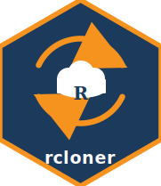

<!-- README.md is generated from README.Rmd. Please edit that file -->

# rcloner 

<!-- badges: start -->

[](https://github.com/boettiger-lab/rcloner/actions/workflows/R-CMD-check.yaml)
[](https://app.codecov.io/gh/boettiger-lab/rcloner?branch=main)
[](https://lifecycle.r-lib.org/articles/stages.html#experimental)
<!-- badges: end -->

`rcloner` provides an R interface to [rclone](https://rclone.org), a
battle-tested, open-source command-line program for managing files on
cloud storage. rclone supports **over 40 cloud storage providers** —
Amazon S3, Google Cloud Storage, Azure Blob Storage, MinIO, Ceph,
Dropbox, and many others — through a single consistent interface.

## Why rcloner?

- **One package for all clouds.** rclone’s backend system means you can
  use the same R functions regardless of storage provider.
- **Actively maintained upstream.** rclone has a large, vibrant
  open-source community and is updated frequently.
- **No credentials in R.** rclone handles authentication securely;
  rcloner simply calls the binary.
- **Familiar output.** Listing functions return standard R data frames.

## Installation

``` r
install.packages("rcloner")
```

Development version:

``` r
# install.packages("pak")
pak::pak("boettiger-lab/rcloner")
```

### Installing the rclone binary

If rclone is not already on your system, install it from within R:

``` r
library(rcloner)
install_rclone()
```

This downloads the appropriate pre-built binary from
<https://downloads.rclone.org> for your platform. No system privileges
required.

## Quick start

``` r
library(rcloner)
rclone_version()
#> rclone v1.60.1-DEV
#> - os/version: ubuntu 24.04 (64 bit)
#> - os/kernel: 6.14.0-32-generic (x86_64)
#> - os/type: linux
#> - os/arch: amd64
#> - go/version: go1.22.2
#> - go/linking: dynamic
#> - go/tags: none
```

### Configure a remote

``` r
# Amazon S3
rclone_config_create(
  "aws",
  type              = "s3",
  provider          = "AWS",
  access_key_id     = Sys.getenv("AWS_ACCESS_KEY_ID"),
  secret_access_key = Sys.getenv("AWS_SECRET_ACCESS_KEY"),
  region            = "us-east-1"
)

# MinIO / S3-compatible
rclone_config_create(
  "minio",
  type              = "s3",
  provider          = "Minio",
  access_key_id     = Sys.getenv("MINIO_ACCESS_KEY"),
  secret_access_key = Sys.getenv("MINIO_SECRET_KEY"),
  endpoint          = "https://minio.example.com"
)
```

### List objects

``` r
# Works on local paths too — no cloud account needed
rclone_ls(tempdir(), files_only = TRUE)
#> [1] Path     Name     Size     MimeType ModTime  IsDir   
#> <0 rows> (or 0-length row.names)
```

``` r
# Cloud path
rclone_ls("aws:my-bucket", recursive = TRUE)
```

### Copy and sync

``` r
src  <- tempfile()
dest <- tempfile()
dir.create(src);  dir.create(dest)
writeLines("hello from rcloner", file.path(src, "readme.txt"))

rclone_copy(src, dest)
list.files(dest)
#> [1] "readme.txt"
```

``` r
# Upload to S3
rclone_copy("/local/data", "aws:my-bucket/data")

# Sync (deletes destination files not in source)
rclone_sync("aws:my-bucket", "/local/backup")

# Copy a URL directly to cloud storage
rclone_copyurl("https://example.com/data.csv", "aws:my-bucket/data.csv")
```

### Other operations

``` r
rclone_cat("aws:my-bucket/README.txt")   # read a file
rclone_stat("aws:my-bucket/data.csv")   # file metadata
rclone_size("aws:my-bucket")            # total size
rclone_mkdir("aws:new-bucket")          # create bucket
rclone_delete("aws:my-bucket/old/")     # delete files
rclone_purge("aws:scratch")             # remove path + contents
rclone_link("aws:my-bucket/report.html")# public link
rclone_about("aws:")                    # quota info
```

## Migrating from minioclient

| `minioclient`    | `rcloner`                |
|------------------|--------------------------|
| `mc_alias_set()` | `rclone_config_create()` |
| `mc_cp()`        | `rclone_copy()`          |
| `mc_mv()`        | `rclone_move()`          |
| `mc_mirror()`    | `rclone_sync()`          |
| `mc_ls()`        | `rclone_ls()`            |
| `mc_cat()`       | `rclone_cat()`           |
| `mc_mb()`        | `rclone_mkdir()`         |
| `mc_rb()`        | `rclone_purge()`         |
| `mc_rm()`        | `rclone_delete()`        |
| `mc_du()`        | `rclone_size()`          |
| `mc()`           | `rclone()`               |

rcloner uses *remotes* (e.g. `"aws:bucket"`) rather than *aliases*
(e.g. `"myalias/bucket"`). Configure remotes with
`rclone_config_create()` instead of `mc_alias_set()`.

## Acknowledgements

`rcloner` is an R wrapper around [rclone](https://rclone.org), the
open-source cloud storage utility written in Go and maintained by the
rclone community. All cloud storage work is performed by the rclone
binary; this package simply provides a convenient R interface to it. See
the [rclone documentation](https://rclone.org/docs/) for the full list
of supported backends and configuration options.

## License

MIT © Carl Boettiger. rclone itself is licensed under the MIT License.
